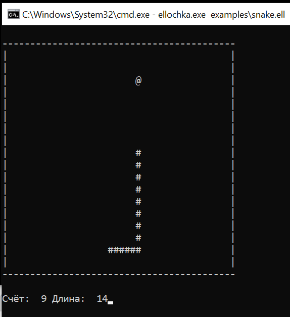
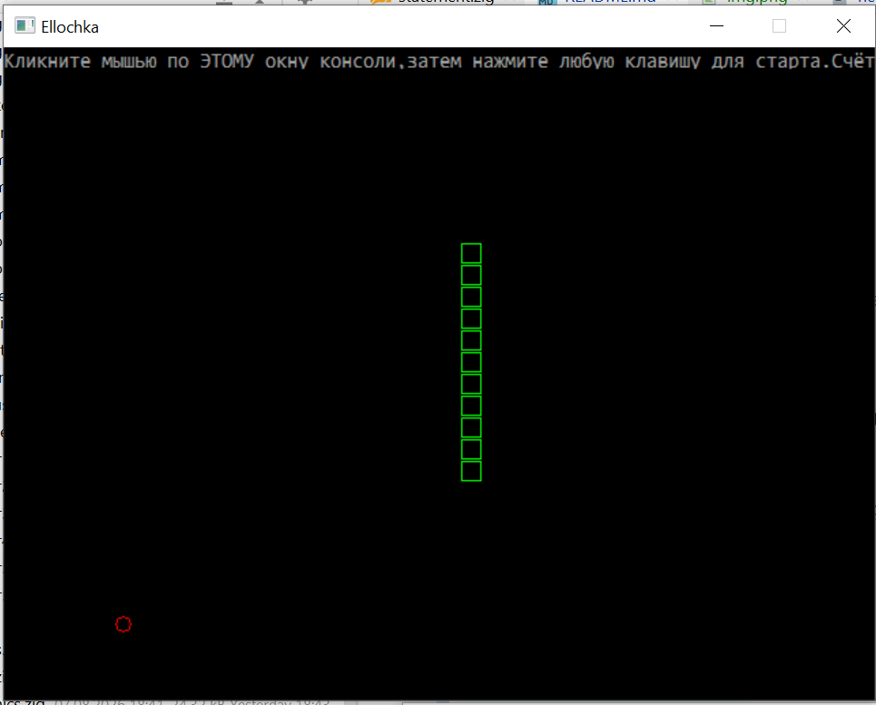

# Ellochka — интерпретатор на Zig

Полная реализация языка программирования `Ellochka` (автор Э.Г. Гаузер,
г. Баку, 1999/2001, версия DIKAR v7) на языке Zig 0.16.0-dev. Все 62
оператора языка реализованы и проверены — оригинальный демонстрационный
файл автора `sample.ela` исполняется от начала до конца без пропусков
функциональности.

**Оригинальное описание языка от автора**:
[https://erichware.com/inform/ellochka.htm](https://erichware.com/inform/ellochka.htm)

## Сборка и запуск

```
zig build
zig build run -- examples/hello.ell
```

Или напрямую после сборки:

```
./zig-out/bin/ellochka examples/hello.ell
```

```bash
ellochka.exe examples\sample_author.ell
```

### Запуск игры змейка на языке Эллочка в консольном режиме

```bash
ellochka.exe examples\snake.ell
```



### Запуск игры змейка на языке Эллочка в графическом режиме

```bash
ellochka.exe examples\snake_graphics.ell
```


## Графический режим

`GRAF` открывает отдельное окно **Ellochka** размером 640×480. Оператор
`TEXT` скрывает окно и возвращает обычный консольный маршрут ввода/вывода.
DIB и GDI-ресурсы не уничтожаются при `TEXT`: последующий `GRAF` показывает
сохранённый графический кадр.

```ela
GRAF
CFON 1
CSIM 15
CLSC
STRO 4
STLB 10
LIST 'Привет из GDI!'\
WAIT
TEXT
EXIT
```

### Текстовая сетка

В графическом режиме используется сетка 80×30 с ячейкой 8×16 пикселей.
`CSIM`, `CFON`, `STRO`, `STLB`, `CLSC` и `LIST` работают непосредственно
в DIB-буфере.

Каноническая семантика `LIST`:

```ela
LIST 'A='
LIST A\
```

Первый оператор продолжает текущую строку, второй с завершающим `\`
выполняет явный переход на следующую строку. Это соответствует авторскому
`sample.ela` и необходимо для вертикального вывода статистики в циклах.

### Ввод клавиатуры

`KEYS A` неблокирующе читает один pending key event или записывает `0`.
`WAIT A` блокируется до события, но продолжает прокачивать Win32 message queue.

```ela
WAIT K
ESLI K == 294; @up
ESLI K == 295; @right
```

| Клавиша | Код |
|---|---:|
| Enter | 13 |
| Esc | 27 |
| Left | 293 |
| Up | 294 |
| Right | 295 |
| Down | 296 |
| PgUp | 289 |
| PgDn | 290 |

`WAIT K#` переводит латинские и русские строчные буквы в верхний регистр:
`д → Д`, `ё → Ё`.

### MENU

```ela
SIZE 4
DATA 1;4;@menu_data
MENU 4;4;10;33;P
```

`MENU N;L;S;C;F`:

- `N` — число пунктов из `$$`;
- `L` — число пунктов страницы;
- `S`, `C` — строка и колонка левого верхнего угла;
- `F` — переменная результата.

В GDI ширина меню фиксирована: 40 знакомест. Выбранный пункт инвертирует
текущие `CSIM` и `CFON`. Поддерживаются стрелки, PgUp/PgDn, Enter и Esc.
При `L > 30` графический backend использует `L = 30`; выход за рамки 80×30
отсекается без автоматического сдвига меню.

Enter записывает номер выбранного пункта в `F`; Esc записывает `0`.

### VVOD

В GDI `VVOD` работает без консольного stdin:

```ela
VVOD 'Возраст: ';A
VVOD 'Город: ';$0
```

Поддерживаются Unicode-символы, Backspace, Enter и Esc. Каретка рисуется
инверсной ячейкой. Backspace удаляет целый UTF-8 code point. Некорректное
число при Enter не останавливает программу: подаётся системный beep, текст
остаётся доступен для исправления. Esc отменяет текущий ввод и сохраняет
старое значение.

Последний `$X` в `VVOD` является строковой целью ввода. `$X`, после которого
есть ещё одна цель ввода, выводится как inline prompt:

```ela
$1 = 'Введите число: '
VVOD $1;A
```

## Unicode и строки

```ela
$0 = 'Привет'
DLIN $0;A
$1 = %MID($0,2,3)
FIND $0;'в';1;B
C:$0[1]
$0[2] = 1044
$2 = %CHR(1,1044)
```

Ожидаемая семантика:

- `DLIN $0;A` записывает `6`, не число UTF-8 байтов;
- `%MID($0,2,3)` возвращает `рив`;
- `FIND` работает с Unicode-позициями;
- `C:$0[1]` возвращает `1055` для `П`;
- `$0[2]=1044` заменяет второй code point на `Д`;
- `%CHR(1,1044)` создаёт строку `Д`.

Составные графемы не нормализуются: каждый Unicode code point считается
отдельным символом.


## Структура проекта

- `src/state.zig` — таблицы переменных, массивов, строк (включая
  массив статических строк `$A`-`$Z` фиксированной длины 75 символов
  и динамические строки `$0`-`$9` произвольной длины до 1024 символов),
  режимы исполнения, палитра.
- `src/errors.zig` — единый набор ошибок парсинга и выполнения.
- `src/lexer.zig` — построчный лексер (токенизация одной строки),
  поддерживает числа без ведущего нуля (`.011`).
- `src/expr.zig` — парсер и вычислитель арифметических выражений;
  математические функции (`&SIN`, `&COS`, `&SQR` и т.д.), унарные
  `+`/`-`, индексация массивов включая сокращённую форму `A[]` (индекс
  текущей неявной итерации).
- `src/program.zig` — загрузка программы, таблица меток, адресация по
  номерам строк; лимит длины строки (75) считается в Unicode-символах,
  а не в байтах UTF-8 (важно для кириллицы).
- `src/statement.zig` — разбор и выполнение всех 62 операторов.
- `src/graphics.zig` — графический слой: окно Win32 + закадровый DIB-буфер
  24bpp, насос сообщений (`pumpMessages`) для отзывчивости окна во время
  блокирующих операций (`WAIT`, `MENU`).
- `src/main.zig` — точка входа, главный цикл интерпретатора.

## Реализовано (62 из 62 операторов)

### Системные (7/7)
`EXIT`, `STOP`, `DOSC` (внешняя команда через `std.process.Child`),
`SIZE` (строковый/1D/2D массивы), `UMEM`, `MEMC`, `CURR`.

### Управляющие (7/7)
`RADI`/`GRDS`, `ORUP`/`ORDN`, `GOTO`, `SLEP`, `ESLI` — включая числовые
условия (`>>`,`<<`,`>=`,`<=`,`==`,`|=`), диапазоны (`X == {Y,Z}` включ.,
`X == }Y,Z{` искл., `|=` — отрицание) и сравнение текстовых переменных
(`$P == $F`).

### Ввод/вывод (12/12)
`GRAF`/`TEXT` (реальное окно 640×480), `CLSC`, `CFON`, `CSIM`, `STRO`,
`STLB`, `KEYS` (неблокирующий опрос), `WAIT` (блокирующий, не морозит
окно графики — неблокирующий поллинг с насосом сообщений), `LIST`,
`VVOD`, `DATA`.

### Графические (9/9)
`PIXL`, `RDOT`, `CVET`, `LINE`, `RAMA`, `MOVE`, `KRUG`, `PAIN`, `SBMP`.
GDI-бэкенд напрямую через WinAPI, 24-битный истинноцветный буфер.

### Файловые (9/9)
`LENF`, `UDAL`, `PATH`, `FILE`, `FREE`, `READ` (все 3 формы: `F;X;Y`,
`F;2K`, `F`), `TYPE` (все 4 формы), `GETF`/`PUTF` (все 4 варианта:
`1M`, `2K`, `A`, `P;R;B`).

### Математические (8/8)
`LIRA` (СЛАУ методом Гаусса с pivoting), `POLI` (полином, схема
Горнера), `DTRM` (определитель со знаком через перестановки строк),
`APRO` (полиномиальная МНК-аппроксимация через нормальные уравнения),
`REAK` (нелинейная регрессия `A·X^B·exp(-C·X)`, Левенберг-Марквардт),
`USER` (аппроксимация произвольной пользовательской функцией, тоже
Левенберг-Марквардт с численным Якобианом), `TRAN` (система нелинейных
уравнений, метод Ньютона с численным Якобианом и backtracking line
search), `NTGR` (интеграл методом трапеций).

### Прочие (10/10)
`MINA`/`MAXA`/`SUMA`, `SORT`, `INCR`/`DECR`, `FIND`, `DLIN`, `MENU`
(многостраничное, стрелки/PgUp/PgDn/Enter/Esc), `JULD` (юлианская дата
в обе стороны, алгоритм Флигеля — Ван Фландерна).

### Присваивание — все 6 вариантов
`A=expr`, `A[]=expr`/`A[,]=expr` (неявные циклы), `A:константа`,
`A:$?[индекс]`, `A#$текст` (вычисление выражения из строки).

### Строковые функции
`%MID`, `%CHR`, `%DATE`, `%TIME`; конкатенация строк через `+`;
посимвольная запись `$?[индекс]=выражение`.

## Проверка сложной математики

Сложный математический scope реализован, но ещё требует системной
сверки с эталонными данными и оригинальным DIKAR:

- `LIRA` — линейная алгебра / решение СЛАУ;
- `POLI` — вычисление полинома;
- `DTRM` — определитель;
- `APRO` — полиномиальная МНК-аппроксимация;
- `REAK` — нелинейная реакционная модель;
- `NTGR` — численное интегрирование;
- `TRAN` — решение нелинейной системы;
- `USER` — пользовательская модель.

До завершения regression suite эти операторы следует считать реализованными,
но требующими дополнительной численной верификации на известных наборах
входных данных.

## Технические уроки этого проекта

- Лимит длины строки (75) должен считаться в Unicode-**символах**, а
  не в байтах UTF-8 — кириллица занимает 2 байта на символ, из-за чего
  валидные строки ложно бракуются как `LineTooLong`.
- Унарный `+` перед выражением (`GOTO +2\`, относительные переходы)
  должен поддерживаться так же, как унарный `-`.
- Хвостовой `\` (подавление перевода строки) в `LIST`/`VVOD`/`TYPE`
  должен отрезаться от списка аргументов **до** разбиения на сегменты
  по `;`, иначе ломает разбор последнего сегмента.
- Эта версия Zig (`0.16.0-dev`) использует нестандартный API: файловые
  операции идут через `std.Io.Dir`/`std.Io.File` с явным параметром
  `io: std.Io` вместо `std.fs.cwd()`; построчное чтение файлов надёжнее
  делать через `allocRemaining` (весь файл разом) + разбор в памяти,
  а не через повторные вызовы `takeDelimiterExclusive` в цикле —
  последнее приводило к зависанию на этой dev-версии стандартной
  библиотеки.

## Тестирование и сравнение на windows и Dos

**Блок 1 — строки и текстовые переменные ($, %)**

| Проверка                 | DOS           | Win           | Совпадение |
| :----------------------- | :------------ | :------------ | :--------- |
| Конкатенация `$0+' '+$1` | `HELLO WORLD` | `HELLO WORLD` | ✅          |
| `DLIN`                   | `11`          | `11`          | ✅          |
| `A:$0[1]` (код символа)  | `72`          | `72`          | ✅          |
| `%MID($0,1,3)`           | `HEL`         | `HEL`         | ✅          |
| `%CHR(3,65)`             | `AAA`         | `AAA`         | ✅          |
| `FIND $0;'LL';1;N`       | `3`           | `3`           | ✅          |
| `$5[1]=65` запись кода   | `AZ`          | `AZ`          | ✅          |

````ela
! ТЕСТ 4: строки $ и % функции
$0='HELLO'
$1='WORLD'
$2=$0+' '+$1
LIST '--- Конкатенация ---'
LIST $2
DLIN $2;L
LIST 'DLIN=';L;'  (ожидание 11)'
A:$0[1]
LIST 'код $0[1]=';A;'  (ожидание 72, H)'
$3=%MID($0,1,3)
LIST '%MID($0,1,3)=';$3;'  (ожидание HEL)'
$4=%CHR(3,65)
LIST '%CHR(3,65)=';$4;'  (ожидание AAA)'
FIND $0;'LL';1;N
LIST 'FIND LL в $0 -> N=';N;'  (ожидание 3)'
$5='ZZ'
$5[1]=65
LIST '$5 после $5[1]=65 ->';$5;'  (ожидание AZ)'
EXIT
````


**Блок 2 — строковый массив и SORT**

| Проверка                        | DOS                                       | Win   | Совпадение |
| :------------------------------ | :---------------------------------------- | :---- | :--------- |
| `SORT $;N;F` (F=1, возрастание) | `apple, banana, cherry, date, elderberry` | то же | ✅          |
| `SORT A;N;F` (F=-1, убывание)   | `50, 40, 30, 20, 10`                      | то же | ✅          |

````ela
! ТЕСТ 5: строковый массив и SORT
SIZE 5
$1='banana'
$2='apple'
$3='cherry'
$4='date'
$5='elderberry'
N=5
F=1
SORT $;N;F
LIST '--- SORT $ по возрастанию ---'
LIST '$1=';$1;'  $2=';$2
LIST '$3=';$3;'  $4=';$4;'  $5=';$5

SIZE [5]=A
A[1]=30
A[2]=10
A[3]=50
A[4]=20
A[5]=40
N=5
F=-1
SORT A;N;F
LIST '--- SORT A по убыванию ---'
LIST 'A[1]=';A[1];'  A[2]=';A[2];'  A[3]=';A[3]
LIST 'A[4]=';A[4];'  A[5]=';A[5]

LIST '--- Конец теста 5 ---'
EXIT
````

**Примечание**:  `SORT` на windows пока **более разрешительный**, чем оригинал: `N` и `F` в windows — любое арифметическое выражение (через `parseExpr`), а спецификация  явно требует, чтобы это были **простые переменные**, а не литералы. 


**Блок 3 - математические функции (&)**

Что проверяет тест:

| Функция                                          | Аргумент   | Ожидание                                                     |
| :----------------------------------------------- | :--------- | :----------------------------------------------------------- |
| `&SIN`/`&COS`/`&TAN` (в градусах, `GRDS`)        | 90/0/45    | 1/1/1                                                        |
| `&ASN`/`&ACS`/`&ATN` (обратные, тоже в градусах) | 1/1/1      | 90/0/45                                                      |
| `&EXP`/`&LOG` (в радианах, `RADI`)               | 0/1        | 1/0                                                          |
| `&INT`/`&FRC` (положит. и отрицат.)              | 5.8/-5.8   | 5/-5 и 0.8/-0.8 — эти два примера взяты **прямо из спецификации** https://erichware.com/inform/ellochka.htm |
| `&ABS`/`&SGN`/`&SQR`                             | -7/-3,0/16 | 7/-1,0/4                                                     |
| `&RAN#`                                          | —          | только диапазон `[0,1)`, не точное значение                  |


| Функция                | DOS         | Win         | Совпадение                        |
| :--------------------- | :---------- | :---------- | :-------------------------------- |
| `SIN(90)`              | `1`         | `1`         | ✅                                 |
| `COS(0)`               | `1`         | `1`         | ✅                                 |
| `TAN(45)`              | `.9999999`  | `1`         | ~ погрешность float32, win точнее |
| `ASN(1)`               | `89.99998`  | `90`        | ~ погрешность float32, win точнее |
| `ACS(1)`               | `0`         | `0`         | ✅                                 |
| `ATN(1)`               | `45`        | `45`        | ✅                                 |
| `EXP(0)`               | `1`         | `1`         | ✅                                 |
| `LOG(1)`               | `0`         | `0`         | ✅                                 |
| `INT(5.8)`/`INT(-5.8)` | `5`/`-5`    | `5`/`-5`    | ✅                                 |
| `FRC(5.8)`/`FRC(-5.8)` | `.8000002`  | `0.8000002` | ✅ (идентичная погрешность!)       |
| `ABS(-7)`              | `7`         | `7`         | ✅                                 |
| `SGN(-3)`/`SGN(0)`     | `-1`/`0`    | `-1`/`0`    | ✅                                 |
| `SQR(16)`              | `4`         | `4`         | ✅                                 |
| `RAN#`                 | в диапазоне | в диапазоне | ✅                                 |

````ela
! ТЕСТ 6: математические функции &
GRDS
B=&sin(90)
LIST 'SIN(90)=';B;'  (ожидание 1)'
B=&cos(0)
LIST 'COS(0)=';B;'  (ожидание 1)'
B=&tan(45)
LIST 'TAN(45)=';B;'  (ожидание 1)'
B=&asn(1)
LIST 'ASN(1)=';B;'  (ожидание 90)'
B=&acs(1)
LIST 'ACS(1)=';B;'  (ожидание 0)'
B=&atn(1)
LIST 'ATN(1)=';B;'  (ожидание 45)'
RADI
B=&exp(0)
LIST 'EXP(0)=';B;'  (ожидание 1)'
B=&log(1)
LIST 'LOG(1)=';B;'  (ожидание 0)'
B=&int(5.8)
LIST 'INT(5.8)=';B;'  (ожидание 5)'
B=&int(-5.8)
LIST 'INT(-5.8)=';B;'  (ожидание -5)'
B=&frc(5.8)
LIST 'FRC(5.8)=';B;'  (ожидание 0.8)'
B=&frc(-5.8)
LIST 'FRC(-5.8)=';B;'  (ожидание -0.8)'
B=&abs(-7)
LIST 'ABS(-7)=';B;'  (ожидание 7)'
B=&sgn(-3)
LIST 'SGN(-3)=';B;'  (ожидание -1)'
B=&sgn(0)
LIST 'SGN(0)=';B;'  (ожидание 0)'
B=&sqr(16)
LIST 'SQR(16)=';B;'  (ожидание 4)'
B=&ran#
ESLI B >> 0; @ranok1
LIST 'RAN# FAIL: < 0'
GOTO @ranend
@ranok1
ESLI B << 1; @ranok2
LIST 'RAN# FAIL: >= 1'
GOTO @ranend
@ranok2
LIST 'RAN# OK: в диапазоне [0,1)'
@ranend
EXIT

````

**Примечание: **`FRC` дал ровно **одинаковую** погрешность `.8000002` в обоих интерпретаторах — значит вычисление дробной части устроено идентично (через `x - trunc(x)`, накапливая ту же ошибку представления `5.8` в двоичной дроби). А вот `TAN(45)` и `ASN(1)` у DOS чуть менее точны (`.9999999`/`89.99998`), на windows — точное `1`/`90`. Тут не ошибка а просто разная реализация тригонометрии.

**Блок 4 — прочие числовые операторы**

- `INCR`/`DECR`
- `MINA`/`MAXA`/`SUMA` (индекс мин/макс, сумма массива)
- `MEMC`/`CURR`/`UMEM` (обнуление, размер, уничтожение массивов)

| Проверка             | DOS           | Win     | Совпадение |
| :------------------- | :------------ | :------ | :--------- |
| `INCR A` (5→6)       | `6`           | `6`     | ✅          |
| `DECR A` x2 (6→4)    | `4`           | `4`     | ✅          |
| `MINA D;I`           | `I=2`         | `I=2`   | ✅          |
| `MAXA D;J`           | `J=3`         | `J=3`   | ✅          |
| `SUMA D;S`           | `S=150`       | `S=150` | ✅          |
| `CURR 1K`            | `K=5`         | `K=5`   | ✅          |
| `MEMC 1D`            | `D[1]=D[3]=0` | то же   | ✅          |
| `MEMC` (все скаляры) | `A=0`         | `A=0`   | ✅          |
| `UMEM 1` + `CURR 1K` | `K=0`         | `K=0`   | ✅          |

````ela
! ТЕСТ 7: INCR DECR MINA MAXA SUMA MEMC CURR UMEM
A=5
INCR A
LIST 'INCR A ->';A;'  (ожидание 6)'
DECR A
DECR A
LIST 'DECR A x2 ->';A;'  (ожидание 4)'

SIZE [5]=D
D[1]=30
D[2]=10
D[3]=50
D[4]=20
D[5]=40
MINA D;I
LIST 'MINA -> I=';I;'  (ожидание 2)'
MAXA D;J
LIST 'MAXA -> J=';J;'  (ожидание 3)'
SUMA D;S
LIST 'SUMA -> S=';S;'  (ожидание 150)'

CURR 1K
LIST 'CURR 1 -> K=';K;'  (ожидание 5)'

MEMC 1D
LIST 'MEMC 1D D[1]=';D[1];'  D[3]=';D[3];'  (0 0)'

A=99
MEMC
LIST 'MEMC(-) A=';A;'  (ожидание 0)'

UMEM 1
CURR 1K
LIST 'UMEM 1, CURR 1 -> K=';K;'  (ожидание 0)'

LIST '--- Конец теста 7 ---'
EXIT

````


**Блок 5 — файловые операции (без интерактивности)**

- `TYPE` — запись в файл
- `LENF` — длина файла до/после записи
- `UDAL` — удаление файла
- `GETF`/`PUTF` — бинарное чтение/запись чисел (`D=4`)
- `PATH` — разрешение пути


| Шаг                                       | DOS                                       | Windows / Zig                                       | Совпадение                                                   |
| :---------------------------------------- | :---------------------------------------- | :-------------------------------------------------- | :----------------------------------------------------------- |
| `TYPE 'out8.txt';'HELLO'\` → `LENF`       | 7 байт                                    | 7 байт                                              | ✅                                                            |
| Второй `TYPE 'out8.txt';'!'` → `LENF`     | 10 байт                                   | 10 байт                                             | ✅                                                            |
| `UDAL 'out8.txt'` → `LENF`                | -1                                        | -1                                                  | ✅                                                            |
| `PUTF ...;1A;4;0;4` → `GETF ...;1B;4;0;4` | `B[1]=3.5`                                | `B[1]=3.5`                                          | ✅                                                            |
| Экранный вывод нескольких `LIST` подряд   | Текст соседних `LIST` сливается на строке | Каждый `LIST` визуально выводится отдельной строкой | Только отображение консоли, не логика и не содержимое файлов |

````ela
! ТЕСТ 8: файловые операции TYPE LENF UDAL GETF PUTF
UDAL 'out8.txt'
TYPE 'out8.txt';'HELLO'\
LENF 'out8.txt';L
LIST 'LENF после TYPE\ ->';L;'  (ожидание 7)'

TYPE 'out8.txt';'!'
LENF 'out8.txt';L
LIST 'LENF после TYPE ! ->';L;'  (ожидание 10)'

UDAL 'out8.txt'
LENF 'out8.txt';L
LIST 'LENF после UDAL ->';L;'  (ожидание -1)'

SIZE [1]=A
A[1]=3.5
UDAL 'out8f.bin'
PUTF 'out8f.bin';1A;4;0;4
SIZE [1]=B
GETF 'out8f.bin';1B;4;0;4
LIST 'PUTF/GETF D=4 ->';B[1];'  (ожидание 3.5)'
UDAL 'out8f.bin'

LIST '--- Конец теста 8 ---'
EXIT

````


**Блок 6 — переходы: доп. случаи**

- `GOTO` на **номер строки** (не метку)
- `GOTO C\` — относительный переход с обратным слешем
- `ESLI $0=='...'` — строковое сравнение (без `;`, только пробел — подтверждено по `sample.ela`)
- `ESLI X**}Y,Z{` — диапазон **исключая** границы


| Проверка                            | Результат |
| :---------------------------------- | :-------- |
| `GOTO 7` на физический номер строки | ✅         |
| Относительный `GOTO +3\`            | ✅         |
| Строковый `ESLI $0=='HELLO'`        | ✅         |
| Строковый `ESLI $0|='WORLD'`        | ✅         |
| Открытый диапазон: `5 ∈ }1,10{`     | ✅         |
| Граница не входит: `1 ∉ }1,10{`     | ✅         |

````ela
! ТЕСТ 9: GOTO номера, относительный переход, ESLI строки/диапазоны
! --- часть 1: GOTO на абсолютный номер строки ---
GOTO 7
LIST 'FAIL: GOTO 7 не сработал'
LIST 'FAIL: GOTO 7 не сработал'
LIST 'FAIL: GOTO 7 не сработал'
LIST 'OK: GOTO 7 сработал'
! --- часть 2: относительный GOTO ---
GOTO +3\
LIST 'FAIL: GOTO +3\ не сработал'
LIST 'FAIL: GOTO +3\ не сработал'
LIST 'OK: GOTO +3\ сработал'
! --- часть 3: строковый ESLI ---
$0='HELLO'
ESLI $0=='HELLO' @stryes
LIST 'FAIL: строковый ESLI =='
GOTO @strend
@stryes
LIST 'OK: строковый ESLI =='
@strend
ESLI $0|='WORLD' @neyes
LIST 'FAIL: строковый ESLI |='
GOTO @neend
@neyes
LIST 'OK: строковый ESLI |='
@neend
! --- часть 4: исключающий диапазон }Y,Z{ ---
A=5
ESLI A == }1,10{ @openyes
LIST 'FAIL: 5 в }1,10{'
GOTO @openend
@openyes
LIST 'OK: 5 в }1,10{'
@openend
A=1
ESLI A == }1,10{ @boundfail
LIST 'OK: 1 не в }1,10{'
GOTO @boundend
@boundfail
LIST 'FAIL: 1 в }1,10{'
@boundend
EXIT
````


**Блок 7 — календарь**

- `JULD` — дата → юлианский день → обратно дата

| Дата        | Результат DOS/Zig    |
| :---------- | :------------------- |
| 01.01.2000  | `2451544.5`          |
| 29.02.2024  | `2460369.5`          |
| 01.03.1900  | `2415079.5`          |
| `J=2451545` | `D=1.5, M=1, Y=2000` |

````ela
! ТЕСТ 10: JULD - строгая совместимость с DOS
! DOS: дата -> JDN-0.5; целый JDN -> D+0.5
! --- 01.01.2000 ---
D=1
M=1
Y=2000
J=0
JULD D;M;Y;J
ESLI J == 2451544.5; @a
LIST 'FAIL: 01.01.2000 -> 2451544.5'
GOTO @d1
@a
LIST 'OK: 01.01.2000 -> 2451544.5'
@d1
D=0
M=0
Y=0
JULD D;M;Y;J
ESLI D == 1; @b
LIST 'FAIL: round-trip 01.01.2000 (D)'
GOTO @d2
@b
ESLI M == 1; @c
LIST 'FAIL: round-trip 01.01.2000 (M)'
GOTO @d2
@c
ESLI Y == 2000; @d
LIST 'FAIL: round-trip 01.01.2000 (Y)'
GOTO @d2
@d
LIST 'OK: round-trip 01.01.2000'
@d2
! --- 29.02.2024 ---
D=29
M=2
Y=2024
J=0
JULD D;M;Y;J
ESLI J == 2460369.5; @e
LIST 'FAIL: 29.02.2024 -> 2460369.5'
GOTO @d3
@e
LIST 'OK: 29.02.2024 -> 2460369.5'
@d3
D=0
M=0
Y=0
JULD D;M;Y;J
ESLI D == 29; @f
LIST 'FAIL: round-trip 29.02.2024 (D)'
GOTO @d4
@f
ESLI M == 2; @g
LIST 'FAIL: round-trip 29.02.2024 (M)'
GOTO @d4
@g
ESLI Y == 2024; @h
LIST 'FAIL: round-trip 29.02.2024 (Y)'
GOTO @d4
@h
LIST 'OK: round-trip 29.02.2024'
@d4
! --- 01.03.1900 ---
D=1
M=3
Y=1900
J=0
JULD D;M;Y;J
ESLI J == 2415079.5; @i
LIST 'FAIL: 01.03.1900 -> 2415079.5'
GOTO @d5
@i
LIST 'OK: 01.03.1900 -> 2415079.5'
@d5
D=0
M=0
Y=0
JULD D;M;Y;J
ESLI D == 1; @j
LIST 'FAIL: round-trip 01.03.1900 (D)'
GOTO @d6
@j
ESLI M == 3; @k
LIST 'FAIL: round-trip 01.03.1900 (M)'
GOTO @d6
@k
ESLI Y == 1900; @l
LIST 'FAIL: round-trip 01.03.1900 (Y)'
GOTO @d6
@l
LIST 'OK: round-trip 01.03.1900'
@d6
! --- целый стандартный JDN в DOS даёт D+0.5 ---
D=0
M=0
Y=0
J=2451545
JULD D;M;Y;J
LIST 'DEBUG: J=2451545 -> D=';D;' M=';M;' Y=';Y
ESLI D == 1.5; @m
LIST 'FAIL: J=2451545 -> D=1.5'
GOTO @d7
@m
ESLI M == 1; @n
LIST 'FAIL: J=2451545 -> M=1'
GOTO @d7
@n
ESLI Y == 2000; @o
LIST 'FAIL: J=2451545 -> Y=2000'
GOTO @d7
@o
LIST 'OK: J=2451545 -> 01.5.2000'
@d7
EXIT
````


## Автор языка и первоисточники

Язык `Ellochka` и оригинальный интерпретатор/редактор `DIKAR` созданы
Эрихом Генриховичем Гаузером (г. Баку, 1999–2001). Официальное описание
языка (то самое, по которому проверялась каждая деталь синтаксиса в
этой реализации) доступно на сайте автора:

- Описание языка `Ellochka`:
  [https://erichware.com/inform/ellochka.htm](https://erichware.com/inform/ellochka.htm)
- История создания интерпретатора и **компилятора** языка Brainfuck,
  написанного автором целиком на самой Эллочке (включая генерацию
  x86-машинного кода в `.com`-файлы через таблицу косвенных переходов —
  однопроходный транслятор, специально спроектированный так, чтобы не
  делать два прохода на медленном интерпретаторе):
  [https://erichware.com/litvor/bfcomint.htm](https://erichware.com/litvor/bfcomint.htm)

На сайте автора также доступны сама программа `DIKAR` (родной
DOS-редактор и интерпретатор) и десятки написанных на Эллочке программ
и игр — эта реализация на Zig не заменяет оригинал, а даёт возможность
запускать программы на Эллочке на современных Windows-системах без
DOS-эмулятора.
